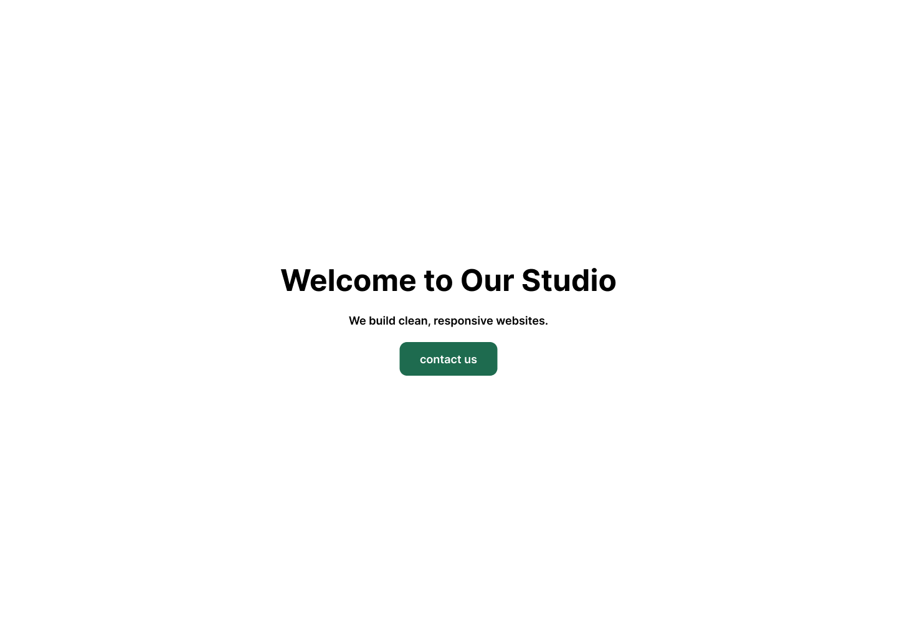
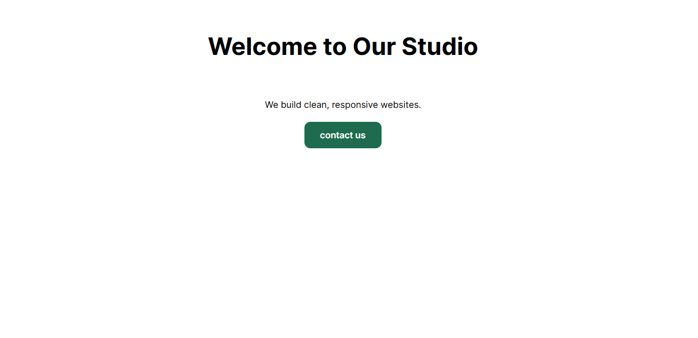

# Figma to Elementor: Hero Section

A hero section designed in Figma and rebuilt in WordPress with Elementor, matching the design from its spec values.

## Design (Figma)

## Result (Elementor)

## Values matched
- Layout: vertical stack, centred, gap 24 px
- Container padding: 64 px on all sides
- Heading: Inter Bold, 48 px
- Paragraph: Inter Regular, 18 px
- Button: background #1E6B4F, white text, Inter SemiBold 18 px,
  padding 16 px top/bottom and 32 px left/right, border radius 12 px

## Tools
Figma (Auto layout, inspect panel), WordPress, Elementor
